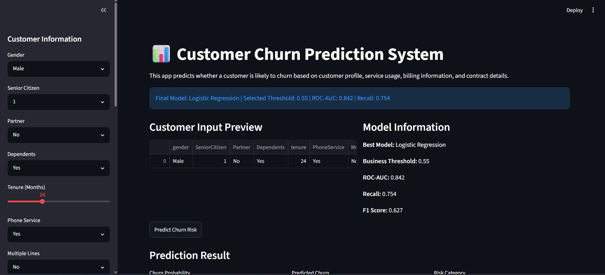
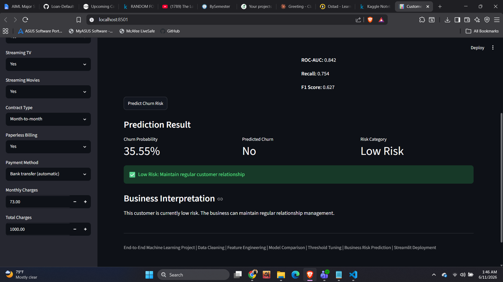

## Live Demo

🔗 Live App: https://customer-churn-prediction-system-pttowxxfebixscym7aenmf.streamlit.app/

🔗 GitHub Repository: https://github.com/NafizNoyon/customer-churn-prediction-system


# Customer Churn Prediction System

An end-to-end machine learning project that predicts customer churn risk using customer profile, service usage, billing information, and contract details. The project covers the complete machine learning workflow: data cleaning, feature engineering, model comparison, threshold tuning, explainability, business risk categorization, and Streamlit deployment.

---

## Project Overview

Customer churn is a major business problem for telecom, banking, SaaS, subscription, and e-commerce companies. Losing existing customers can reduce revenue and increase customer acquisition costs. This project predicts whether a customer is likely to churn and provides a business-friendly risk category with recommended actions.

The final Streamlit app allows a user to enter customer details and returns:

* Churn probability
* Predicted churn status
* Risk category: Low Risk, Medium Risk, or High Risk
* Recommended business action

---

## Business Problem

The goal of this project is to help a business identify customers who are likely to leave the service. By identifying high-risk customers early, the business can take retention actions such as personalized offers, customer support follow-up, or targeted engagement campaigns.

---

## Dataset

Dataset used: Telco Customer Churn Dataset

The dataset contains customer demographic information, account details, service subscriptions, billing method, charges, and churn status.

Target variable:

* `Churn = 0`: Customer did not churn
* `Churn = 1`: Customer churned

After cleaning, the dataset contains:

* 7,043 rows
* 20 cleaned columns
* No missing values
* Binary encoded churn target

---

## Tools and Technologies

* Python
* Pandas
* NumPy
* Scikit-learn
* XGBoost
* Logistic Regression
* Random Forest
* Streamlit
* Joblib
* Jupyter Notebook / Kaggle Notebook
* GitHub

---

## Project Workflow

1. Data loading
2. Data cleaning
3. Missing value handling
4. Feature engineering
5. Exploratory data analysis
6. Model training
7. Model comparison
8. Best model selection
9. Threshold tuning
10. Business risk categorization
11. Model explainability
12. Model artifact saving
13. Streamlit app development

---

## Data Cleaning

The dataset was cleaned before model training.

Main cleaning steps:

* Converted `TotalCharges` from object type to numeric
* Handled invalid or blank values in `TotalCharges`
* Filled missing `TotalCharges` values using median
* Removed `customerID` because it is an identifier, not a predictive feature
* Converted `Churn` from Yes/No to binary values
* Checked missing values and duplicate records

---

## Feature Engineering

Additional business-relevant features were created to improve model learning and business interpretation.

Engineered features:

* `TenureGroup`: customer lifecycle stage based on tenure
* `HasInternetService`: whether the customer has internet service
* `IsMonthToMonth`: whether the customer has a month-to-month contract
* `NumberOfSupportServices`: number of support/security services used
* `AverageChargesPerTenure`: customer spending intensity over tenure

---

## Exploratory Data Analysis Summary

Key findings:

* The dataset is imbalanced:

  * No Churn: 73.46%
  * Churn: 26.54%
* Contract type is a strong churn-related factor
* Customers with month-to-month contracts are more likely to churn
* Tenure is highly important for churn prediction
* Customers with shorter tenure are more likely to churn
* Internet service type and monthly charges influence churn behavior
* Service-related features such as OnlineSecurity and TechSupport are relevant to churn risk

---

## Models Trained

Three machine learning models were trained and compared:

1. Logistic Regression
2. Random Forest Classifier
3. XGBoost Classifier

The final model was selected based on business relevance, ROC-AUC, recall, F1-score, and interpretability.

---

## Final Model

Final selected model:

**Logistic Regression**

Although more complex models were tested, Logistic Regression was selected because it provided strong performance and better interpretability for business decision-making.

---

## Final Model Performance

| Metric             | Score |
| ------------------ | ----: |
| Accuracy           | 0.762 |
| Precision          | 0.537 |
| Recall             | 0.754 |
| F1-score           | 0.627 |
| ROC-AUC            | 0.842 |
| Selected Threshold |  0.55 |

---

## Confusion Matrix

Using the selected threshold of 0.55:

|                 | Predicted No Churn | Predicted Churn |
| --------------- | -----------------: | --------------: |
| Actual No Churn |                792 |             243 |
| Actual Churn    |                 92 |             282 |

The model correctly identified 282 churn customers and missed 92 churn customers.

---

## Threshold Tuning

The default threshold of 0.50 was not used directly. Threshold tuning was applied to create a more business-oriented churn prediction system.

The selected threshold was:

**0.55**

This threshold was chosen because it maintained strong recall while keeping F1-score balanced. In churn prediction, recall is important because missing a real churn customer can be more costly than targeting a customer who may not actually churn.

---

## Business Risk Categorization

Predicted churn probabilities were converted into business-friendly risk categories.

| Risk Category | Probability Range | Recommended Action                                      |
| ------------- | ----------------- | ------------------------------------------------------- |
| Low Risk      | Below 40%         | Maintain regular customer relationship                  |
| Medium Risk   | 40% to 70%        | Monitor customer and offer personalized engagement      |
| High Risk     | 70% or above      | Immediate retention offer or customer support follow-up |

Risk category validation:

| Risk Category | Actual Churn Rate |
| ------------- | ----------------: |
| High Risk     |            61.19% |
| Medium Risk   |            32.85% |
| Low Risk      |             6.32% |

This shows that the risk categories are meaningful and business-relevant.

---

## Explainability

Two explainability approaches were used:

1. Logistic Regression coefficient-based feature importance
2. Model-agnostic permutation importance

Top important features based on permutation importance:

* tenure
* InternetService
* MonthlyCharges
* IsMonthToMonth
* Contract
* TenureGroup
* StreamingMovies
* StreamingTV
* AverageChargesPerTenure
* OnlineSecurity

These features help explain why a customer may be at higher or lower churn risk.

---

## Streamlit App

The Streamlit app allows users to enter customer details and receive real-time churn prediction.

App output includes:

* Churn probability
* Predicted churn status
* Risk category
* Recommended business action
* Model performance summary

---

## Screenshots

### Streamlit Dashboard



### Prediction Result




---

## Project Structure

```text
customer-churn-prediction/
│
├── data/
│   └── cleaned_telco_customer_churn.csv
│
├── models/
│   ├── customer_churn_prediction_pipeline.pkl
│   └── model_metadata.json
│
├── notebooks/
│   └── customer_churn_prediction_notebook.ipynb
│
├── reports/
│   ├── coefficient_feature_importance.csv
│   ├── final_model_performance.csv
│   ├── permutation_importance.csv
│   ├── risk_analysis_sample.csv
│   └── threshold_results.csv
│
├── screenshots/
│   ├── streamlit_dashboard.png
│   ├── prediction_result.png
│   ├── threshold_tuning.png
│   └── feature_importance.png
│
├── src/
│
├── app.py
├── README.md
└── requirements.txt
```

---

## How to Run Locally

Clone the repository:

```bash
git clone https://github.com/your-username/customer-churn-prediction.git
cd customer-churn-prediction
```

Create and activate a virtual environment:

```bash
py -3.12 -m venv .venv
.\.venv\Scripts\Activate.ps1
```

Install dependencies:

```bash
python -m pip install -r requirements.txt
```

Run the Streamlit app:

```bash
python -m streamlit run app.py
```

---

## Requirements

```text
streamlit
pandas
numpy
joblib
xgboost
scikit-learn==1.6.1
```

---

## Key Learning Outcomes

This project demonstrates:

* End-to-end machine learning workflow
* Data cleaning and preprocessing
* Feature engineering
* Classification model training
* Model comparison
* Class imbalance awareness
* Threshold tuning
* Business-oriented model evaluation
* Model explainability
* Streamlit dashboard development
* Deployment-ready project structure

---

## Future Improvements

Possible future improvements:

* Deploy the app on Streamlit Cloud
* Add SHAP-based local explanations
* Add customer-level explanation in the dashboard
* Add batch CSV upload prediction
* Add FastAPI backend
* Add Docker support
* Add database integration
* Add automated model retraining pipeline

---

## Final Summary

This project is a complete customer churn prediction system designed for real-world business use. It does not only train a machine learning model but also converts model output into business-friendly risk categories and recommended actions. The final system is suitable for customer retention analysis, business decision support, and machine learning portfolio demonstration.
